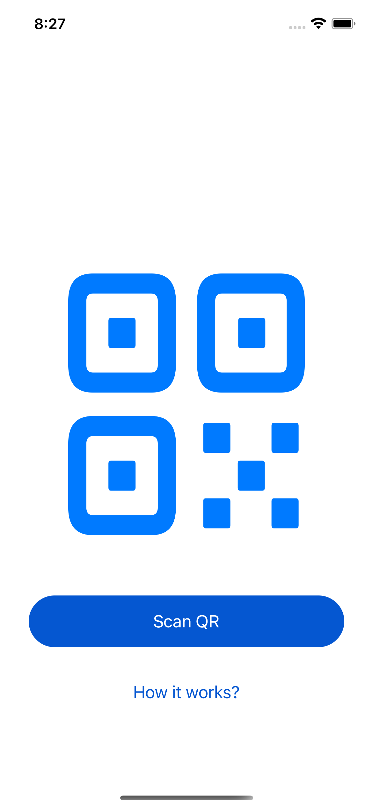
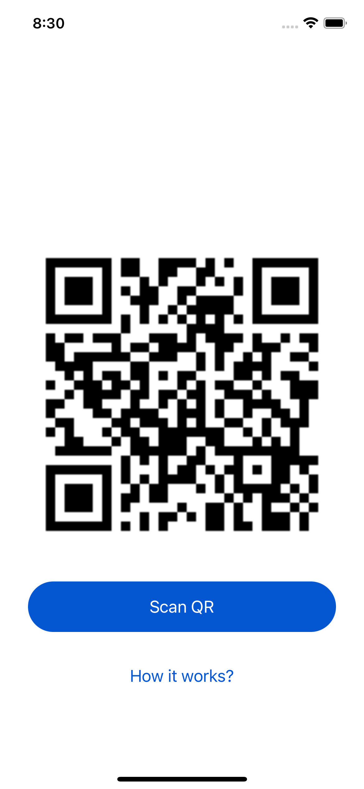

#  QR widget for Home Screen

This application allows you to add a QR code widget to your home screen.

## How it works

1. Scan QR with build-in scanner
1. Add widget to home screen 
1. ProTip: You can remove app icon from home screen, but keeping widget working, [read the docs](https://support.apple.com/guide/iphone/remove-apps-iph248b543ca/ios) 'Remove an app from the Home Screen' section.

## Architecture

- Common folder conains reusable elements, used both, in the app and in the widget sources.
- QrWidget contains the app based on [YARCH](https://github.com/alfa-laboratory/YARCH) architecture.
- Widget contains ios widget sources.

## Used libraries

- [SnapKit](https://snapkit.io/) used for layout management

